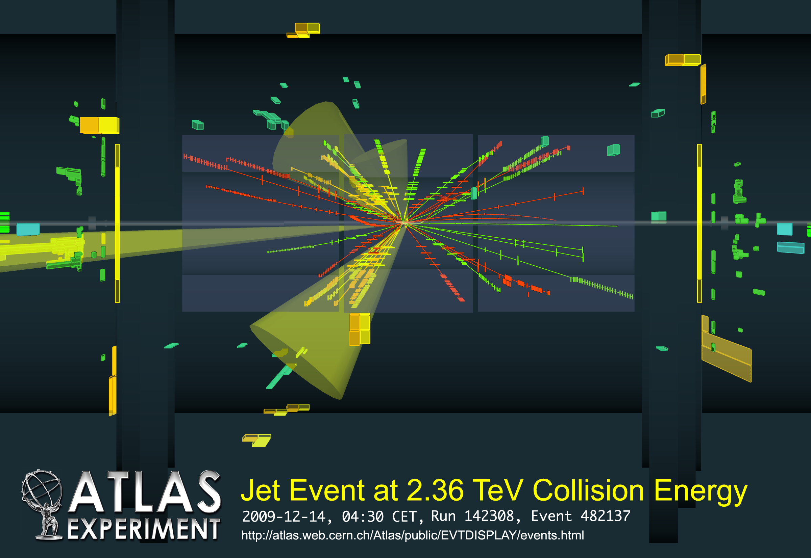
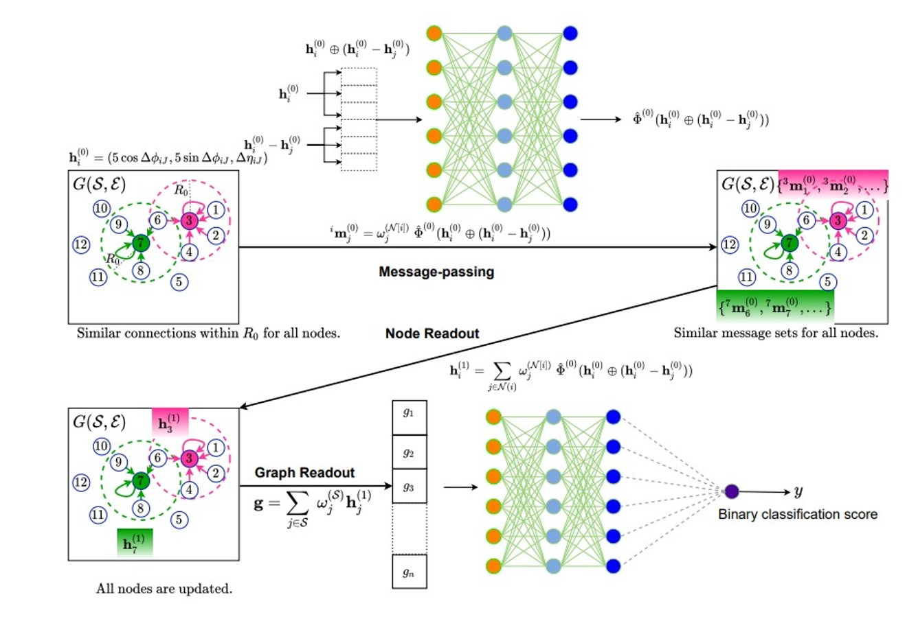
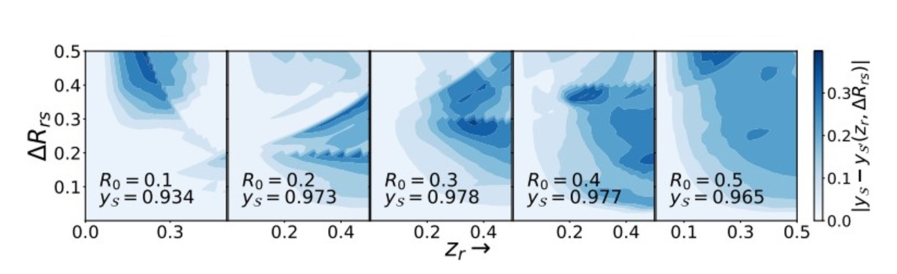
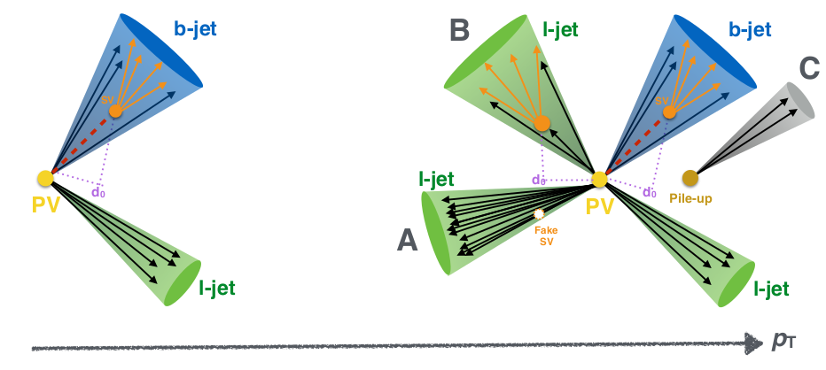
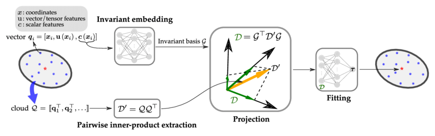
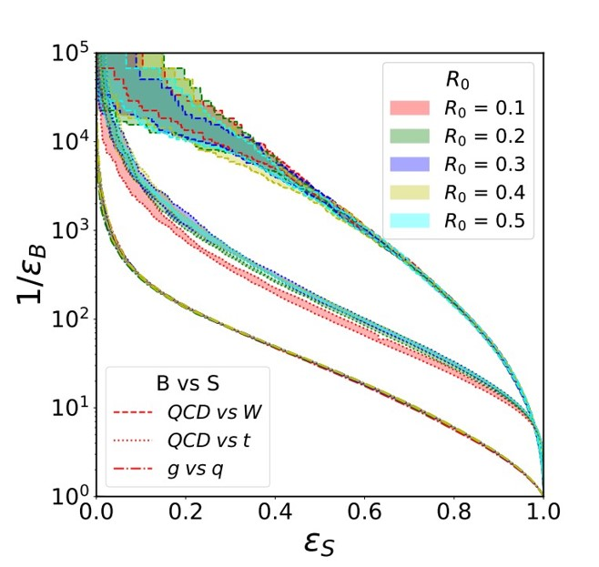

# 🚀 HyperGraph Magic: Unraveling Jets with HMPNNs


📡 **"Houston, we have jets!"** 🛰️

🎉 Welcome to the journey of **HyperGraph Message Passing Neural Networks** (HMPNNs) exploring the mesmerizing realm of high-energy particle collisions! Strap in, because we're about to decode the symphony of particles through a fusion of physics and machine learning. 🤯



## ⚛️ Quantum Chronicles of QCD

🔬 **Quantum Chromodynamics (QCD)**, the tale of strong quark-gluon interactions, sets the stage for our journey:

https://github.com/rajveer43/hep_ml/assets/64583161/c6034ad6-aa9b-4c5b-a00b-fe305d05cbbd

🔥 **"Particle Aria"** - Jets emerge as sparkling sprays of particles in high-energy collisions, their songs resonating through the cosmos. 🌠

⚛️ **"QCD's Cosmic Dance"** - QCD jets, birthed from quarks and gluons, converse a different cosmic language compared to non-QCD jets. Their energy, multiplicity, and dance steps set them apart. 💃

🪐 **"Quantum Properties"** - Jet classification unveils their essence: the *jet mass, substructure, energy, and a plethora of features* shape their cosmic choreography. 🛰️

## 🌟 Stars in the Jet Constellation


<!--add the dataset of the particle jets -->

🌟 **"Our Celestial Ensemble"** - The dataset twinkles with MC simulated events, unraveling top quark tagging mysteries. 1.2M training events, 400k validation events, and 400k test events make up our cosmic ensemble. 🎭

🔍 **"Particle Puzzle Pieces"** - The dataset embodies hadronic tops for the signal, QCD diets background, Pythia8's ATLAS detector card, and the Pythia 8-generated quark and gluon jet datasets. Each piece holds a cosmic puzzle. 🧩

## 🚀 Particle Jet Portals




🪐 **"Hypergraph Voyage"** - We steer the cosmic ship of Hypergraph Message Passing, crafting graphs in the (η, φ)-plane and passing cosmic messages to weave cosmic insights. 🚢

🎩 **"Magic Four-Vectors"** - Directions sculpt our message weights, as four-vectors dance with information exchange, painting the cosmic symphony of jet features. 🌈

Quark-Gluon Dataset Features

The Pythia8 Quark and Gluon Jets dataset contains the following features:

| Feature Name | Data Type | Description                    |
|--------------|-----------|--------------------------------|
| pt           | Float     | Transverse momentum            |
| eta          | Float     | Pseudorapidity                 |
| phi          | Float     | Azimuthal angle                |
| mass         | Float     | Invariant mass                 |
| b-tag        | Bool      | b-tagging information          |
| particle ID  | Int       | ID of the particle             |
| charge       | Int       | Charge of the particle         |
| isQuark      | Bool      | True if quark, False if gluon  |
| label        | Int       | 0 for gluon, 1 for quark       |

Top Quark Tagging Dataset Features

The Top Quark Tagging Dataset contains the following features:

| Feature                      | Data Type   | Description                                            |
|-----------------------------|-------------|--------------------------------------------------------|
| Event ID                     | Categorical | Unique identifier for the event                        |
| Jet ID                       | Categorical | Unique identifier for the jet                          |
| number of tracks             | Numeric     | Number of charged particle tracks in the jet           |
| number of SVs                | Numeric     | Number of secondary vertexes associated with the jet   |
| jet energy/mass/width/sd_mass| Numeric     | Various properties of the jet                         |
| track 1-3 d0/d0Err/z0/z0Err  | Numeric     | Impact parameters and associated errors of tracks     |
| track 1-3 pt/eta/phi/e/charge| Numeric     | Kinematic and charge properties of tracks             |
| SV 1-3 flight distance/flight distance error/mass/energy ratio| Numeric | Properties of secondary vertexes         |
| is_signal_new                | Binary      | Binary indicator of whether the jet is a top quark or not |

🧙‍♂️ **"Neural Cosmic Oracle"** - A cosmic climax ensues as our cosmic representation reaches the cosmic Neural Network Oracle. The oracle's verdict unveils the cosmic binary classification score, decoding QCD and non-QCD jets' cosmic essence. 🌌

## 🪐 Pioneering Particle Performances

In the grand theater of high-energy collisions, the particle jets dance with complexity and mystery. These performances are captivating, yes, but often a conundrum. Fear not, for our cast of **Neural Networks** are here to decipher the enigmatic jets with precision! 🌌


🤖 **"Classifier Extraordinaire!"** - Our algorithm shines in distinguishing jet types, unraveling secrets essential for a myriad of physics analyses. 🕵️‍♂️



🧙‍♂️ **"Magic of IRC Safety!"** - With a sprinkle of physics, our HMPNNs honor IRC safety, ensuring predictions stay steadfast even in the face of soft emissions. 🪄


📡 **"Navigating the Jet Stream!"** - Taming the QCD radiation dragon, our neural wizards stay cool while venturing into the vast jet landscape. 🌀



💥 **"Scalable Sorcery!"** - Be it tiny jets or colossal ones, our HMPNNs flaunt the magic of scalability, adapting to various jet sizes and types. 🎩

## 🌟 Glorious Galaxy of Findings


✨ **Stellar Performance** - Our model shines bright with stellar accuracy and AUC in distinguishing top quarks from QCD jets. The stars align for precision! ✨

Algorithm

```python
Input: QCD and non-QCD jet data

# Preprocess the data
    Split data into training and testing sets

# Define the Hypergraph Message Passing Permutation Invariant Neural Network architecture
    Define Function: ConstructHypergraph(batch_data)
        # Constructs a hypergraph for the given batch of data
        ...

    Define Function: MessagePassing(hypergraph)
        # Performs hypergraph message passing
        ...

    Define Function: PermutationInvariant(features)
        # Computes the permutation invariant representation
        ...

# Define the Neural Network architecture
    Define Function: ClassificationNN(input_dim, hidden_dim, output_dim)
        # Defines the classification neural network architecture
        ...

# Training
For each epoch in range(num_epochs):
    For each batch_data in training_data:
        hypergraph = ConstructHypergraph(batch_data)
        MessagePassing(hypergraph)
        representation = PermutationInvariant(features)
        classification_output = ClassificationNN(representation)
        loss = CalculateLoss(classification_output, labels)
        UpdateParameters(loss)

# Classification
For each batch_data in testing_data:
    hypergraph = ConstructHypergraph(batch_data)
    MessagePassing(hypergraph)
    representation = PermutationInvariant(features)
    classification_output = ClassificationNN(representation)
    predicted_labels = ApplySoftmax(classification_output)
    final_labels = Classify(predicted_labels)

Output: Predicted class labels for testing_data
```

Simple Model Code:
```python
import torch
import torch.nn as nn
import torch.optim as optim
from torch_geometric.data import Data, DataLoader
from torch_geometric.nn import MessagePassing

# Define the Hypergraph Message Passing Permutation Invariant Neural Network
class HypergraphMessagePassingPINN(nn.Module):
    def __init__(self, input_dim, hidden_dim, output_dim):
        super(HypergraphMessagePassingPINN, self).__init__()

        # Define hypergraph construction, message passing, and permutation invariant layers
        self.hypergraph_layer = HypergraphConstructionLayer(input_dim, hidden_dim)
        self.message_passing_layer = MessagePassingLayer(hidden_dim)
        self.permutation_invariant_layer = PermutationInvariantLayer(hidden_dim, output_dim)

    def forward(self, data):
        # Construct hypergraph
        hypergraph = self.hypergraph_layer(data)

        # Perform hypergraph message passing
        x = self.message_passing_layer(hypergraph)

        # Compute permutation invariant representation
        representation = self.permutation_invariant_layer(x)

        return representation
```

1. AUC Values for Gluons vs Quark Tagging Dataset

| Sr. No. | R<sub>0</sub> | Accuracy       |
| ------- | ------------- | -------------- |
| 1       | 0.1           | 0.8824±0.0005 |
| 2       | 0.1           | 0.8888±0.0013 |
| 3       | 0.2           | 0.8909±0.0009 |
| 4       | 0.3           | 0.8916±0.0008 |
| 5       | 0.4           | 0.8919±0.0006 |

2. AUC Values for Top Tagging Dataset

| Sr. No. | R<sub>0</sub> | Accuracy       |
| ------- | ------------- | -------------- |
| 1       | 0.1           | 0.9734±0.0009 |
| 2       | 0.2           | 0.9764±0.0004 |
| 3       | 0.3           | 0.9779±0.0005 |
| 4       | 0.4           | 0.9782±0.0002 |
| 5       | 0.5           | 0.9781±0.0002 |

3. AUC Values for W Tagging Dataset

| Sr. No. | R<sub>0</sub> | Accuracy       |
| ------- | ------------- | -------------- |
| 1       | 0.1           | 0.9865±0.0004 |
| 2       | 0.2           | 0.9864±0.0004 |
| 3       | 0.3           | 0.9863±0.0004 |
| 4       | 0.4           | 0.9868±0.0004 |
| 5       | 0.5           | 0.9868±0.0005 |



🌐 **Hypergraph Odyssey** - In the land of hypergraphs, our HMPNNs are fearless explorers, traversing multiple nodes, hyperedges, and labels. 🛰️



🌌 **Cosmic Radius Reckoning** - Tune in for the cosmic dance as we test different values of R, controlling jet radius. Bigger isn't always better, and smaller isn't always wiser. 🔮

## 🚀 Quantum Implications

From deep within the heart of high-energy physics to the cosmos of machine learning, our journey opens realms of possibility:

- 🌌 **Jet Pioneering**: Elevate QCD and non-QCD jet classification for enhanced high-energy physics experiments. Results that are out of this world! 🚀

- 💡 **Collider Enchantment**: Enrich collider event simulations with precise jet classification. It's like a magical touch to the particle orchestra. 🎻

- 🌀 **Anomaly Alchemy**: Detect anomalies in collider data and unlock the secrets of new physics beyond the Standard Model. Spells of discovery are cast! 🔍

- 📈 **Calibration Chronicles**: Jet calibration gets a boost with the wizardry of HMPNNs, ensuring particle property determinations are on point. 📊

- 🎩 **Innovation Spells**: Our HMPNN saga inspires new machine learning techniques, reverberating beyond particle physics into diverse realms. 💬

<!--  -->
## Strengths 💪

- 🚀 **Astounding Discrimination**: The model soars with impressive accuracy and AUC in distinguishing top quarks from QCD jets. Its prowess lays a solid foundation for confident analysis.

- ⚛️ **Physical Motivation**: The model thrives on a physics-driven approach, upholding IRC safety. This ensures outcomes remain unwavering despite the twists and turns of collinear or soft emissions.

- 🔧 **Radiation Resilience**: Deftly taming QCD radiation, the model maintains numerical stability. It doesn't flinch in the face of intricate complexities.

- 📐 **Scalable Brilliance**: Flexing its muscle, the model adapts effortlessly to jets of varying sizes. Its versatility extends to other jet species, promising adaptability in the evolving landscape.

- 🔍 **Guiding Insights**: The model isn't just a black box; it's a window into the core features that underscore the art of discriminating top quarks from their QCD counterparts.

## Limitations 🤷‍♂️

- 🌎 **Narrowed Horizons**: Grounded in simulated data, the model's brilliance may dim when faced with the wild terrain of real-world scenarios. Caution is advised in generalization.

- 🎭 **Pattern Presumption**: While based on divergent radiation patterns of top quarks and QCD jets, reality can sometimes paint a different picture, potentially curbing the model's versatility.

- 🕸️ **Complexity Conundrum**: The model might occasionally falter in the face of intricate jets, where the complexities weave a web that's tough to unravel.

- 💻 **Computation Capers**: As jet sizes swell and networks deepen, computational costs might rise, stretching the model's resource limits.

- ❓ **Cryptic Predictions**: Peering into the model's predictions might resemble deciphering an enigma. Interpretability can be elusive, demanding extra effort to decipher its inner workings.

## Applications

Our analysis presents a multitude of potential use cases that extend beyond the realm of QCD and non-QCD jet classification. These applications underscore the significance of our findings and pave the way for broader advancements in particle physics research:

- **Empowering High-Energy Physics Experiments:** The precision of QCD and non-QCD jet classification holds immense value in high-energy physics experiments. Harnessing the capabilities of HMPNNs within jet analysis can elevate the accuracy and efficacy of machine learning-driven QCD investigations, yielding results that are not just insightful but also steadfastly dependable.

- **Elevating Collider Event Simulations:** The categorization of jets stands as a pivotal aspect of collider event simulations. Through our HMPNN-based methodology, we augment the fidelity of jet classification, ushering in a new era of simulations that encapsulate particle collisions with unprecedented accuracy.

- **Unearthing Anomalies in Collider Data:** By leveraging the prowess of HMPNNs, our approach reaches beyond mere jet classification to anomaly detection within collider data. Detecting these anomalous events offers the potential for breakthrough discoveries that transcend the bounds of the Standard Model.

- **Enhancing Jet Calibration:** Jet calibration hinges on precise jet classification, a cornerstone for the meticulous determination of particle properties. HMPNNs contribute to refined jet calibration, where classifications transcend accuracy, leading to more profound insights.

- **Pioneering Novel Machine Learning Techniques:** The introduction of HMPNNs into jet analysis fosters the emergence of innovative machine learning techniques. These techniques have the potential to reshape diverse arenas of particle physics research, expanding their horizon and impact.

Our findings resonate across various domains in particle physics research, including:

- The monumental Large Hadron Collider (LHC) experiments, exemplified by ATLAS and CMS, which grapple with vast datasets that demand meticulous analysis.

- Particle physics research initiatives exploring the enigmatic properties of the Higgs boson, dark matter, and the intriguing realm of supersymmetry. Here, accurate jet classification stands as a cornerstone.

- The frontiers of particle detector development, where the accuracy of particle collision simulations plays a pivotal role in scrutinizing the efficacy of newly devised detectors.

## 🌌 Beam Me Up, Scotty!

1. 🛸 Clone the repository: `git clone https://github.com/rajveer43/hep_ml.git`
2. 🌌 Navigate to the project realm: `cd hep_ml`
3. 🪄 Set up your mystical environment: `pip install -r requirements.txt`
4. 🌟 Explore the `images/` galaxy for captivating data explorations and spellbinding model training examples.

## 🪐 Beyond the Stars: Cosmic Fellowship

- **Join the Cosmic Circle**: A cosmic contribution is a beacon in our galactic journey. Engage through a cosmic pull request and intertwine your cosmic magic!
- **Astro-Potion (Issue)**: For grand cosmic spells, step into the cosmic realm of issues to conjure discussions on cosmic ideas.

## ⚡ Cosmic Code

This cosmic journey abides under the [Cosmic License](LICENSE), granting cosmic sovereignty in wielding its magic!

## ⚡ Warp-Speed License

This project is enchanted under the [MIT License](LICENSE), allowing you to wield its powers with freedom!

<!-- --- -->

<!-- 🚀 Embark with us on a journey that transcends particles and codes, and let's redefine the frontiers of understanding together! ⚛️ -->


<!-- # 🚀 HyperGraph Alchemy: Deciphering Particle Jets with HMPNNs

🌌 **"Where Particles Meet Magic!"** 🪄

🎉 Greetings, cosmic wanderer! Venture into the cosmic depths with us as we wield the power of **HyperGraph Message Passing Neural Networks (HMPNNs)** to illuminate the enigmatic realm of high-energy particle collisions. 🌠 -->

<!--  -->


---

⚛️ Venture forth with us into the cosmic frontier where particles dance and codes merge, reshaping the cosmos of understanding! 🌌
