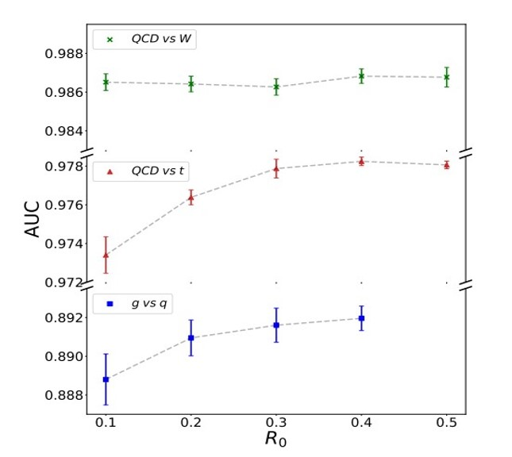

# 🚀 HyperGraph Magic: Unraveling Jets with HMPNNs

## Table of Contents
1. [🚀 HyperGraph Magic: Unraveling Jets with HMPNNs](#hypergraph-magic:-unraveling-jets-with-HMPNNs)
2. [Hypergraph Message Passing Neural Networks](#hypergraph-message-passing-neural-networks-for-jet-analysis)
3. [Unveiling the Subnuclear World: Exploring Particle Physics Beyond the Standard Model](#unveiling-the-subnuclear-world-exploring-particle-physics-beyond-the-standard-model)
   - 3.1 [Key Points](#key-points)
4. [Research Objectives and Research Questions](#research-objectives-and-research-questions)
   - 4.1 [Research Objectives](#research-objectives)
   - 4.2 [Research Questions](#research-questions)
5. [🚀 **"Houston, we have jets!"** 🛰️](#houston-we-have-jets)
6. [⚛️ Quantum Chronicles of QCD](#quantum-chronicles-of-qcd)
7. [🌟 Stars in the Jet Constellation](#stars-in-the-jet-constellation)
8. [🪐 Pioneering Particle Performances](#pioneering-particle-performances)
   - 8.1 [Strengths](#strengths)
   - 8.2 [Limitations](#limitations)
   - 8.3 [Applications](#applications)
9. [🌌 Beam Me Up, Scotty!](#beam-me-up-scotty)
10. [🪐 Beyond the Stars: Cosmic Fellowship](#beyond-the-stars-cosmic-fellowship)
11. [Acknowledgments](#acknowledgments)
12. [⚡ Cosmic Code](#cosmic-code)
13. [⚡ Warp-Speed License](#warp-speed-license)


## Hypergraph Message Passing Neural Networks for Jet Analysis

<p align="justify">The field of high-energy particle collision analysis has witnessed a surge in the utilization of machine learning techniques, particularly neural networks. These algorithms offer the potential to glean valuable insights from the intricate data resulting from these collisions. However, traditional neural network architectures like CNNs and RNNs fall short when dealing with the intricate and structured nature of such data.</p>

<p align="justify">In recent times, the spotlight has turned to Graph Neural Networks (GNNs) for analyzing graph-structured data. Their triumphs span across computer vision, natural language processing, and other domains. Yet, the customary GNN framework operates under the assumption of binary, unordered edges—a limitation when applied to jet analysis.</p>

<p align="justify">Enter Hypergraphs—a dynamic, expressive alternative to represent jet data. Unlike graphs, hypergraphs embrace hyperedges capable of linking multiple nodes and sporting multiple labels. Hypergraph Neural Networks (HGNNs) have emerged as a solution to extend GNNs to hypergraphs. However, their potential in jet analysis remains relatively untapped.</p>

<p align="justify">In this context, Hypergraph Message Passing Neural Networks (HMPNNs) come into play. A novel spin on HGNNs, HMPNNs leverage message passing algorithms to enhance node and hyperedge features within a hypergraph. This approach, successful in domains like image segmentation and social network analysis, is ripe for exploration in jet analysis.</p>

HMPNNs bring a multitude of motivations to the table. Firstly, the adaptability of hypergraphs offers a nuanced portrayal of intricate high-energy collision data. Moreover, the sophisticated message passing algorithms of HMPNNs unravel the intricate relationships between nodes and hyperedges, resulting in richer and more precise data representations.

Through this innovative approach, HMPNNs hold the promise to unlock hidden insights within jet analysis data, ultimately contributing to a deeper understanding of the complex world of particle collisions.

## Unveiling the Subnuclear World: Exploring Particle Physics Beyond the Standard Model

The Large Hadron Collider (LHC) unites multidisciplinary expertise to unravel matter's subnuclear structure. Operating under the Standard Model's (SM) umbrella, LHC's proton collisions adhere to three fundamental interactions—electromagnetic, weak nuclear, and strong nuclear forces. However, the SM remains incomplete, fueling inquiries into dark matter, matter-antimatter asymmetry, and more.

This project delves into Beyond Standard Model (BSM) Particle Physics. We analyze particle jets generated in high-energy LHC collisions. Jets, collimated particle sprays, emerge from quarks and gluons combining to form hadrons, shedding light on fundamental particle properties and interaction forces.


These particle jets play a pivotal role in understanding complex interactions. By adopting Hypergraph Message Passing Neural Networks (HMPNNs), we navigate the intricate relationships within jet data, aiming to unlock hidden insights. This innovative approach extends beyond traditional models, enhancing our comprehension of particle collisions.

### Key Points
- LHC investigates matter's subnuclear structure through proton collisions.
- While the Standard Model explains fundamental forces, it's incomplete.
- BSM Particle Physics explores jet data using novel techniques.
- Particle jets provide insights into fundamental particle properties.
- HMPNNs promise to unveil new insights by deciphering jet data relationships.

[Watch Video](https://www.youtube.com/watch?v=VIDEO_ID)

## Research Objectives and Research Questions

### Research Objectives:

- Develop a hypergraph message passing neural network architecture for analyzing jets in high-energy particle collisions.
- Assess the performance of the proposed hypergraph model.
- Interpret the results, highlighting their significance in jet analysis, and explore the model's strengths and limitations.
- Suggest future enhancements and research paths for hypergraph message passing neural networks in jet analysis and related domains.

### Research Questions:

1. How can hypergraph message passing neural networks effectively analyze jets in high-energy particle collisions?
2. How does the accuracy and computational efficiency of the proposed hypergraph model compare to other leading approaches?
3. What insights can be derived from the model's outcomes, and how do they impact the realm of high-energy physics jet analysis?
4. What are the discernible strengths and limitations of the proposed model, and what avenues for improvement are worth investigating in future studies?

Feel free to refer to the [complete research proposal](link_to_your_full_research_proposal.pdf) for comprehensive details.


## 📡 **"Houston, we have jets!"** 🛰️

🎉 Welcome to the journey of **HyperGraph Message Passing Neural Networks** (HMPNNs) exploring the mesmerizing realm of high-energy particle collisions! Strap in, because we're about to decode the symphony of particles through a fusion of physics and machine learning. 🤯


## ⚛️ Quantum Chronicles of QCD

🔬 **Quantum Chromodynamics (QCD)**, the tale of strong quark-gluon interactions, sets the stage for our journey:

https://github.com/rajveer43/hep_ml/assets/64583161/c6034ad6-aa9b-4c5b-a00b-fe305d05cbbd

🔥 **"Particle Aria"** - Jets emerge as sparkling sprays of particles in high-energy collisions, their songs resonating through the cosmos. 🌠

⚛️ **"QCD's Cosmic Dance"** - QCD jets, birthed from quarks and gluons, converse a different cosmic language compared to non-QCD jets. Their energy, multiplicity, and dance steps set them apart. 💃

🪐 **"Quantum Properties"** - Jet classification unveils their essence: the *jet mass, substructure, energy, and a plethora of features* shape their cosmic choreography. 🛰️

## 🌟 Stars in the Jet Constellation

🌟 **"Our Celestial Ensemble"** - The dataset twinkles with MC simulated events, unraveling top quark tagging mysteries. 1.2M training events, 400k validation events, and 400k test events make up our cosmic ensemble. 🎭

The data has been produced using Monte Carlo simulations. The first 21 features (columns 2-22) are kinematic properties measured by the particle detectors in the accelerator. The last seven features are functions of the first 21 features; these are high-level features derived by physicists to help discriminate between the two classes. There is an interest in using deep learning methods to obviate the need for physicists to manually develop such features. Benchmark results using Bayesian Decision Trees from a standard physics package and 5-layer neural networks are presented in the original paper. The last 500,000 examples are used as a test set.

#### Quark and Gluon Jet Datasets - Pythia 8 Generated

This dataset contains two sets of jet data generated using Pythia 8, representing quark and gluon jets. There are two versions of the dataset: one that includes all kinematically realizable quark jets and another that excludes charm and bottom quark jets at the level of the hard process. The generation parameters for these datasets are as follows:

- Pythia Version: 8.226 (without bc jets), 8.235 (with bc jets)
- Center-of-Mass Energy: √s = 14 TeV
- Quark Source: WeakBosonAndParton:qg2gmZq
- Gluon Source: WeakBosonAndParton:qqbar2gmZg (with Z boson decaying to neutrinos)
- Jet Algorithm: FastJet 3.3.0, anti-kt algorithm with R=0.4
- Transverse Momentum Range: pjetT ∈ [500, 550] GeV
- Pseudorapidity Range: |yjet| < 1.7

Each dataset consists of 20 files, stored in compressed NumPy format. Files that include charm and bottom jets have 'withbc' in their filename. Each file contains two arrays:

1. **X (Features)**: A 3-dimensional array of shape (100000, M, 4), where M is the maximum multiplicity of jets in the file. The array represents a mix of 50,000 quark jets and 50,000 gluon jets, randomly sorted. Each particle in a jet is described by four features: transverse momentum (pt), rapidity, azimuthal angle, and pdgid (particle ID).
2. **y (Labels)**: An array of shape (100000,), providing labels for the jets. A label of 0 corresponds to gluon jets, and a label of 1 corresponds to quark jets.

If you use this dataset, kindly cite the following sources:
- Zenodo Record: [Link](https://zenodo.org/record/3164691#.YWR6WrxBzm4)
- Corresponding Paper: P. T. Komiske, E. M. Metodiev, J. Thaler, "Energy Flow Networks: Deep Sets for Particle Jets," JHEP 01 (2019) 121, [arXiv:1810.05165](https://arxiv.org/abs/1810.05165).

For the corresponding Herwig jet dataset, you can find it on this [Zenodo Record](add-zenodo-link-for-herwig-jets).

To work with these datasets in Python, you can use the EnergyFlow Python package for automatic download and reading.

#### Top Quark Tagging Reference Dataset

This dataset serves as a reference for the evaluation of top quark tagging architectures and includes MC simulated training/testing events. The dataset has been prepared by Kasieczka, Gregor; Plehn, Tilman; Thompson, Jennifer; Russel, Michael.

#### Dataset Overview

- Total Training Events: 1.2 million
- Total Validation Events: 400,000
- Total Test Events: 400,000

Use the following labels to distinguish different purposes:
- `train`: Training events
- `val`: Validation events during training
- `test`: Final testing and reporting results

#### Description

- Energy: 14 TeV
- Signal: Hadronic tops
- Background: QCD dijets
- Detector Simulation: Delphes ATLAS detector card with Pythia 8
- No MPI/pile-up included
- Jet Clustering: Particle-flow entries (produced by Delphes E-flow) clustered into anti-kT 0.8 jets
- Jet Transverse Momentum Range: [550, 650] GeV
- Jet Eta Range: |eta| < 2
- Jet Matching: All top jets matched to a parton-level top within ∆R = 0.8 and to all top decay partons within 0.8
- Jet Constituents: Leading 200 jet constituent four-momenta stored with zero-padding for jets with fewer than 200 constituents
- Constituent Sorting: Constituents sorted by pT, highest pT first
- Truth Top Four-Momentum: Stored as truth_px, truth_py, truth_pz, truth_e
- Jet Classification: A flag `is_signal_new` provided for each jet (1 for top, 0 for QCD)
- Dataset Classification: Variable `ttv` (= test/train/validation) indicates the dataset a jet belongs to

#### Citation

If you use this dataset for your research, please cite the creators:
- Kasieczka, Gregor; Plehn, Tilman; Thompson, Jennifer; Russel, Michael

🔍 **"Particle Puzzle Pieces"** - The dataset embodies hadronic tops for the signal, QCD diets background, Pythia8's ATLAS detector card, and the Pythia 8-generated quark and gluon jet datasets. Each piece holds a cosmic puzzle. 🧩

## 🚀 Particle Jet Portals


🪐 **"Hypergraph Voyage"** - We steer the cosmic ship of Hypergraph Message Passing, crafting graphs in the (η, φ)-plane and passing cosmic messages to weave cosmic insights. 🚢

🎩 **"Magic Four-Vectors"** - Directions sculpt our message weights, as four-vectors dance with information exchange, painting the cosmic symphony of jet features. 🌈

Quark-Gluon Dataset Features

The Pythia8 Quark and Gluon Jets dataset contains the following features:

| Feature Name | Data Type | Description                    |
|--------------|-----------|--------------------------------|
| pt           | Float     | Transverse momentum            |
| eta          | Float     | Pseudorapidity                 |
| phi          | Float     | Azimuthal angle                |
| mass         | Float     | Invariant mass                 |
| b-tag        | Bool      | b-tagging information          |
| particle ID  | Int       | ID of the particle             |
| charge       | Int       | Charge of the particle         |
| isQuark      | Bool      | True if quark, False if gluon  |
| label        | Int       | 0 for gluon, 1 for quark       |

Top Quark Tagging Dataset Features

The Top Quark Tagging Dataset contains the following features:

| Feature                      | Data Type   | Description                                            |
|-----------------------------|-------------|--------------------------------------------------------|
| Event ID                     | Categorical | Unique identifier for the event                        |
| Jet ID                       | Categorical | Unique identifier for the jet                          |
| number of tracks             | Numeric     | Number of charged particle tracks in the jet           |
| number of SVs                | Numeric     | Number of secondary vertexes associated with the jet   |
| jet energy/mass/width/sd_mass| Numeric     | Various properties of the jet                         |
| track 1-3 d0/d0Err/z0/z0Err  | Numeric     | Impact parameters and associated errors of tracks     |
| track 1-3 pt/eta/phi/e/charge| Numeric     | Kinematic and charge properties of tracks             |
| SV 1-3 flight distance/flight distance error/mass/energy ratio| Numeric | Properties of secondary vertexes         |
| is_signal_new                | Binary      | Binary indicator of whether the jet is a top quark or not |

🧙‍♂️ **"Neural Cosmic Oracle"** - A cosmic climax ensues as our cosmic representation reaches the cosmic Neural Network Oracle. The oracle's verdict unveils the cosmic binary classification score, decoding QCD and non-QCD jets' cosmic essence. 🌌

## 🪐 Pioneering Particle Performances

In the grand theater of high-energy collisions, the particle jets dance with complexity and mystery. These performances are captivating, yes, but often a conundrum. Fear not, for our cast of **Neural Networks** are here to decipher the enigmatic jets with precision! 🌌



🤖 **"Classifier Extraordinaire!"** - Our algorithm shines in distinguishing jet types, unraveling secrets essential for a myriad of physics analyses. 🕵️‍♂️


🧙‍♂️ **"Magic of IRC Safety!"** - With a sprinkle of physics, our HMPNNs honor IRC safety, ensuring predictions stay steadfast even in the face of soft emissions. 🪄


📡 **"Navigating the Jet Stream!"** - Taming the QCD radiation dragon, our neural wizards stay cool while venturing into the vast jet landscape. 🌀


💥 **"Scalable Sorcery!"** - Be it tiny jets or colossal ones, our HMPNNs flaunt the magic of scalability, adapting to various jet sizes and types. 🎩

## 🌟 Glorious Galaxy of Findings


✨ **Stellar Performance** - Our model shines bright with stellar accuracy and AUC in distinguishing top quarks from QCD jets. The stars align for precision! ✨

Algorithm

```python
Input: QCD and non-QCD jet data

# Preprocess the data
    Split data into training and testing sets

# Define the Hypergraph Message Passing Permutation Invariant Neural Network architecture
    Define Function: ConstructHypergraph(batch_data)
        # Constructs a hypergraph for the given batch of data
        ...

    Define Function: MessagePassing(hypergraph)
        # Performs hypergraph message passing
        ...

    Define Function: PermutationInvariant(features)
        # Computes the permutation invariant representation
        ...

# Define the Neural Network architecture
    Define Function: ClassificationNN(input_dim, hidden_dim, output_dim)
        # Defines the classification neural network architecture
        ...

# Training
For each epoch in range(num_epochs):
    For each batch_data in training_data:
        hypergraph = ConstructHypergraph(batch_data)
        MessagePassing(hypergraph)
        representation = PermutationInvariant(features)
        classification_output = ClassificationNN(representation)
        loss = CalculateLoss(classification_output, labels)
        UpdateParameters(loss)

# Classification
For each batch_data in testing_data:
    hypergraph = ConstructHypergraph(batch_data)
    MessagePassing(hypergraph)
    representation = PermutationInvariant(features)
    classification_output = ClassificationNN(representation)
    predicted_labels = ApplySoftmax(classification_output)
    final_labels = Classify(predicted_labels)

Output: Predicted class labels for testing_data
```

Simple Model Code:
```python
import torch
import torch.nn as nn
import torch.optim as optim
from torch_geometric.data import Data, DataLoader
from torch_geometric.nn import MessagePassing

# Define the Hypergraph Message Passing Permutation Invariant Neural Network
class HypergraphMessagePassingPINN(nn.Module):
    def __init__(self, input_dim, hidden_dim, output_dim):
        super(HypergraphMessagePassingPINN, self).__init__()

        # Define hypergraph construction, message passing, and permutation invariant layers
        self.hypergraph_layer = HypergraphConstructionLayer(input_dim, hidden_dim)
        self.message_passing_layer = MessagePassingLayer(hidden_dim)
        self.permutation_invariant_layer = PermutationInvariantLayer(hidden_dim, output_dim)

    def forward(self, data):
        # Construct hypergraph
        hypergraph = self.hypergraph_layer(data)

        # Perform hypergraph message passing
        x = self.message_passing_layer(hypergraph)

        # Compute permutation invariant representation
        representation = self.permutation_invariant_layer(x)

        return representation
```

1. AUC Values for Gluons vs Quark Tagging Dataset

| Sr. No. | R<sub>0</sub> | Accuracy       |
| ------- | ------------- | -------------- |
| 1       | 0.1           | 0.8824±0.0005 |
| 2       | 0.1           | 0.8888±0.0013 |
| 3       | 0.2           | 0.8909±0.0009 |
| 4       | 0.3           | 0.8916±0.0008 |
| 5       | 0.4           | 0.8919±0.0006 |

2. AUC Values for Top Tagging Dataset

| Sr. No. | R<sub>0</sub> | Accuracy       |
| ------- | ------------- | -------------- |
| 1       | 0.1           | 0.9734±0.0009 |
| 2       | 0.2           | 0.9764±0.0004 |
| 3       | 0.3           | 0.9779±0.0005 |
| 4       | 0.4           | 0.9782±0.0002 |
| 5       | 0.5           | 0.9781±0.0002 |

3. AUC Values for W Tagging Dataset

| Sr. No. | R<sub>0</sub> | Accuracy       |
| ------- | ------------- | -------------- |
| 1       | 0.1           | 0.9865±0.0004 |
| 2       | 0.2           | 0.9864±0.0004 |
| 3       | 0.3           | 0.9863±0.0004 |
| 4       | 0.4           | 0.9868±0.0004 |
| 5       | 0.5           | 0.9868±0.0005 |


🌐 **Hypergraph Odyssey** - In the land of hypergraphs, our HMPNNs are fearless explorers, traversing multiple nodes, hyperedges, and labels. 🛰️


🌌 **Cosmic Radius Reckoning** - Tune in for the cosmic dance as we test different values of R, controlling jet radius. Bigger isn't always better, and smaller isn't always wiser. 🔮

## 🚀 Quantum Implications

From deep within the heart of high-energy physics to the cosmos of machine learning, our journey opens realms of possibility:

- 🌌 **Jet Pioneering**: Elevate QCD and non-QCD jet classification for enhanced high-energy physics experiments. Results that are out of this world! 🚀

- 💡 **Collider Enchantment**: Enrich collider event simulations with precise jet classification. It's like a magical touch to the particle orchestra. 🎻

- 🌀 **Anomaly Alchemy**: Detect anomalies in collider data and unlock the secrets of new physics beyond the Standard Model. Spells of discovery are cast! 🔍

- 📈 **Calibration Chronicles**: Jet calibration gets a boost with the wizardry of HMPNNs, ensuring particle property determinations are on point. 📊

- 🎩 **Innovation Spells**: Our HMPNN saga inspires new machine learning techniques, reverberating beyond particle physics into diverse realms. 💬

<!--  -->
## Strengths 💪

- 🚀 **Astounding Discrimination**: The model soars with impressive accuracy and AUC in distinguishing top quarks from QCD jets. Its prowess lays a solid foundation for confident analysis.

- ⚛️ **Physical Motivation**: The model thrives on a physics-driven approach, upholding IRC safety. This ensures outcomes remain unwavering despite the twists and turns of collinear or soft emissions.

- 🔧 **Radiation Resilience**: Deftly taming QCD radiation, the model maintains numerical stability. It doesn't flinch in the face of intricate complexities.

- 📐 **Scalable Brilliance**: Flexing its muscle, the model adapts effortlessly to jets of varying sizes. Its versatility extends to other jet species, promising adaptability in the evolving landscape.

- 🔍 **Guiding Insights**: The model isn't just a black box; it's a window into the core features that underscore the art of discriminating top quarks from their QCD counterparts.

## Limitations 🤷‍♂️

- 🌎 **Narrowed Horizons**: Grounded in simulated data, the model's brilliance may dim when faced with the wild terrain of real-world scenarios. Caution is advised in generalization.

- 🎭 **Pattern Presumption**: While based on divergent radiation patterns of top quarks and QCD jets, reality can sometimes paint a different picture, potentially curbing the model's versatility.

- 🕸️ **Complexity Conundrum**: The model might occasionally falter in the face of intricate jets, where the complexities weave a web that's tough to unravel.

- 💻 **Computation Capers**: As jet sizes swell and networks deepen, computational costs might rise, stretching the model's resource limits.

- ❓ **Cryptic Predictions**: Peering into the model's predictions might resemble deciphering an enigma. Interpretability can be elusive, demanding extra effort to decipher its inner workings.

## Applications

Our analysis presents a multitude of potential use cases that extend beyond the realm of QCD and non-QCD jet classification. These applications underscore the significance of our findings and pave the way for broader advancements in particle physics research:

- **Empowering High-Energy Physics Experiments:** The precision of QCD and non-QCD jet classification holds immense value in high-energy physics experiments. Harnessing the capabilities of HMPNNs within jet analysis can elevate the accuracy and efficacy of machine learning-driven QCD investigations, yielding results that are not just insightful but also steadfastly dependable.

- **Elevating Collider Event Simulations:** The categorization of jets stands as a pivotal aspect of collider event simulations. Through our HMPNN-based methodology, we augment the fidelity of jet classification, ushering in a new era of simulations that encapsulate particle collisions with unprecedented accuracy.

- **Unearthing Anomalies in Collider Data:** By leveraging the prowess of HMPNNs, our approach reaches beyond mere jet classification to anomaly detection within collider data. Detecting these anomalous events offers the potential for breakthrough discoveries that transcend the bounds of the Standard Model.

- **Enhancing Jet Calibration:** Jet calibration hinges on precise jet classification, a cornerstone for the meticulous determination of particle properties. HMPNNs contribute to refined jet calibration, where classifications transcend accuracy, leading to more profound insights.

- **Pioneering Novel Machine Learning Techniques:** The introduction of HMPNNs into jet analysis fosters the emergence of innovative machine learning techniques. These techniques have the potential to reshape diverse arenas of particle physics research, expanding their horizon and impact.

Our findings resonate across various domains in particle physics research, including:

- The monumental Large Hadron Collider (LHC) experiments, exemplified by ATLAS and CMS, which grapple with vast datasets that demand meticulous analysis.

- Particle physics research initiatives exploring the enigmatic properties of the Higgs boson, dark matter, and the intriguing realm of supersymmetry. Here, accurate jet classification stands as a cornerstone.

- The frontiers of particle detector development, where the accuracy of particle collision simulations plays a pivotal role in scrutinizing the efficacy of newly devised detectors.

## 🌌 Beam Me Up, Scotty!

1. 🛸 Clone the repository: `git clone https://github.com/rajveer43/hep_ml.git`
2. 🌌 Navigate to the project realm: `cd hep_ml`
3. 🪄 Set up your mystical environment: `pip install -r requirements.txt`
4. 🌟 Explore the `images/` galaxy for captivating data explorations and spellbinding model training examples.

## 🪐 Beyond the Stars: Cosmic Fellowship

- **Join the Cosmic Circle**: A cosmic contribution is a beacon in our galactic journey. Engage through a cosmic pull request and intertwine your cosmic magic!
- **Astro-Potion (Issue)**: For grand cosmic spells, step into the cosmic realm of issues to conjure discussions on cosmic ideas.

## Acknowledgments

This dataset was created and hosted by the following organizations:

- [CERN (European Organization for Nuclear Research)](https://home.cern/)
- [Zenodo](https://zenodo.org/)
- [Fermilab](https://www.fnal.gov/)

## Acknowledgments for the Project Repo

- [Physical Research Laboratory](https://www.prl.res.in/)
- [Durham University](https://www.dur.ac.uk/)
- [Indian Institute of Technology (IIT) Gandhinagar](https://www.iitgn.ac.in/)

We extend our sincere gratitude to these organizations for their invaluable contributions to the field of particle physics and their support in making this dataset available to the research community.

## ⚡ Cosmic Code

This cosmic journey abides under the [Cosmic License](LICENSE), granting cosmic sovereignty in wielding its magic!

## ⚡ Warp-Speed License

This project is enchanted under the [MIT License](LICENSE), allowing you to wield its powers with freedom!

<!-- --- -->

<!-- 🚀 Embark with us on a journey that transcends particles and codes, and let's redefine the frontiers of understanding together! ⚛️ -->


<!-- # 🚀 HyperGraph Alchemy: Deciphering Particle Jets with HMPNNs

🌌 **"Where Particles Meet Magic!"** 🪄

🎉 Greetings, cosmic wanderer! Venture into the cosmic depths with us as we wield the power of **HyperGraph Message Passing Neural Networks (HMPNNs)** to illuminate the enigmatic realm of high-energy particle collisions. 🌠 -->
---

⚛️ Venture forth with us into the cosmic frontier where particles dance and codes merge, reshaping the cosmos of understanding! 🌌
